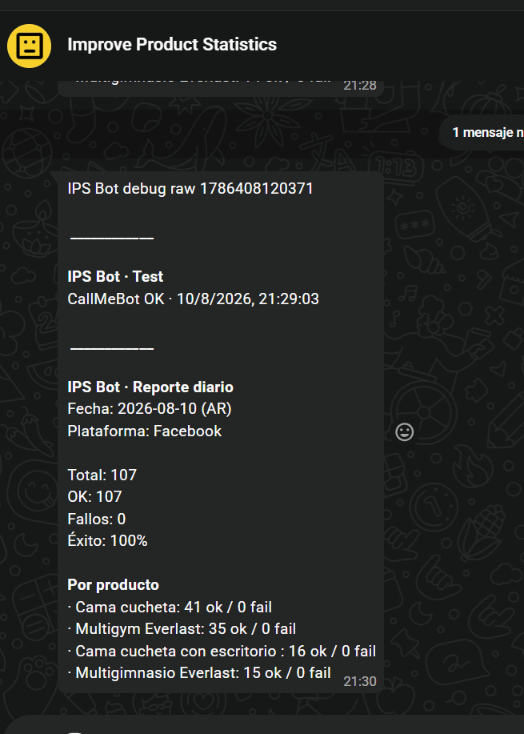

<div align="center">
  
</div>

<div align="right">
  
  &nbsp;
  
  &nbsp;
  
  &nbsp;
  
  &nbsp;
  
  &nbsp;
  
</div>

<br>

<div align="right">
  <a href="./doc/assets/translation/README.es.md" target="_blank">
    
  </a>
  &nbsp;
  <a href="./README.md" target="_blank">
    
  </a>
</div>

<div align="center">

# Improve Product Statistics Bot 

</div>

This is operations software that **visits, measures, alerts and reports**: a 24/7 automation bot that opens your listings again and again so product views and stats improve. Built with **Node.js**, **Puppeteer**, **Express** and **Socket.IO**, it runs the headless loop, records every OK/fail, and puts you in control with a live **Monitor**, an **Actions** panel (Gmail + WhatsApp / CallMeBot) and a **Database** page on port **9008**. Drop it in local **Docker** and let it work while you sell.

* [**UI (local):**](http://localhost:9008/)
* [Functional tests video](https://www.youtube.com/watch?v=QMlpFdOQHfI) <a href="https://www.youtube.com/watch?v=QMlpFdOQHfI" target="_blank"></a>

<br>

## Index 📜

<details>
  <summary> View details </summary>

<br>

<div align="right">

`Last update: 13/08/26`

</div>

### Section 1) Description, configuration and technologies

* [1.0) Description.](#10-description-)
* [1.1) Project execution.](#11-project-execution-)
* [1.2) Project structure.](#12-project-structure-)
* [1.3) Technologies.](#13-technologies-)

### Section 2) Usage flow and behavior

* [2.0) App flow.](#20-app-flow-)
* [2.1) Monitor UI.](#21-monitor-ui-)
* [2.2) Actions panel (Gmail & CallMeBot).](#22-actions-panel-gmail--callmebot-)
* [2.3) Database & persistence.](#23-database--persistence-)
* [2.4) Notifications policy.](#24-notifications-policy-)

### Section 3) Testing, Docker and references

* [3.0) Functional test.](#30-functional-test-)
* [3.1) Docker (recommended on Windows).](#31-docker-recommended-on-windows-)
* [3.2) Contributing.](#32-contributing-)
* [3.3) License.](#33-license-)

</details>

<br>

## Section 1) Description, configuration and technologies

### 1.0) Description [🔝](#index-)

<details>
  <summary>View details</summary>

<br>

This is a **Marketplace visit auto-incrementer**: an automation bot whose job is to push listing views and keep product statistics moving while you focus on selling. It is **not** a chat bot — it is ops software that visits, measures, alerts and reports.

Why it exists:

* Marketplace rankings and social proof reward **active listings**. Manual refresh does not scale.
* This bot turns that grind into a **continuous visit engine**: open URL → stay on page → log result → next product → repeat.
* You watch everything from a local dashboard and get **Gmail / WhatsApp** when something breaks or when the day closes.

What the product delivers:

* **Auto visit loop:** Puppeteer (+ stealth) opens each configured listing, stays long enough to count as a real visit, and records OK or fail.
* **Multi-platform ready:** Facebook Marketplace is live (`enabled: true`); MercadoLibre is built in and waiting (`enabled: false`) until captcha / verification cools down.
* **Live Monitor (`/`):** totals, success rate, live charts, filters, full history, latest failures and per-product breakdown — Socket.IO, no refresh spam.
* **Actions panel (`/actions.html`):** channel status, secret show/hide, WhatsApp tests, fail-alert drills, daily report send (preview / Gmail / WA / both) plus persisted send history.
* **Database admin (`/admin.html`):** visit store and action-log insight, with a safe clear for visits only.
* **Smart notifications:** daily digest ~**21:00 AR** (Gmail + WhatsApp); on fail, WhatsApp if instant, otherwise **Gmail immediately** when CallMeBot queues.
* **Zero-code listing edits:** drop URLs in `facebook.urls.json` / `mercadolibre.urls.json`; secrets stay in `.env`.
* **Always-on runtime:** `npm run dev` for tweaks, or **Docker Desktop** 24/7 on **9008** for production-style local ops.

**Requirements:**

* [Node.js](https://nodejs.org/) ≥ 18 (local `npm run dev`).
* [Docker Desktop](https://www.docker.com/products/docker-desktop/) (recommended for 24/7 on Windows).
* Gmail App Password (reports / fail fallback).
* CallMeBot phone + apikey (WhatsApp).
* Modern browser for the UI.

</details>

### 1.1) Project execution [🔝](#index-)

<details>
  <summary>View details</summary>

<br>

* Clone and enter the repo:

```bash
git clone https://github.com/andresWeitzel/improve-product-statistics-bot.git
cd improve-product-statistics-bot
```

* Copy env + listing files (never commit secrets / real URLs):

```bash
cp .env.example .env
cp facebook.urls.example.json facebook.urls.json
cp mercadolibre.urls.example.json mercadolibre.urls.json
```

Edit `facebook.urls.json` / `mercadolibre.urls.json` as `{ "Product name": "https://..." }`. The `*.urls.example.json` files are placeholders only.

#### Gmail (Nodemailer / App Password)

Needed for the **daily report** and as **fail-alert fallback** when CallMeBot queues.

1. Use a Google account with [2-Step Verification](https://myaccount.google.com/security) enabled.
2. Create an [App Password](https://myaccount.google.com/apppasswords) (app: Mail).
3. In `.env` set:

```env
MAIL_ENABLED=true
MAIL_USER=you@gmail.com
MAIL_PASS=xxxx xxxx xxxx xxxx
MAIL_TO=you@gmail.com
MAIL_FROM=Improve Product Stats <you@gmail.com>
MAIL_FAIL_ENABLED=true
REPORT_HOUR=21
REPORT_PLATFORM=facebook
```

> `MAIL_PASS` is the **16-character App Password**, not your normal Gmail password.

#### WhatsApp (CallMeBot API)

Needed for connectivity tests, fail alerts, and the daily report on WhatsApp.

1. Add the CallMeBot contact and activate the API as described here: [CallMeBot — Free WhatsApp API](https://www.callmebot.com/blog/free-api-whatsapp-messages/).
2. You get a **phone** (international, no `+`) and an **apikey**.
3. In `.env` set:

```env
WHATSAPP_ENABLED=true
WHATSAPP_PHONE=54911xxxxxxxx
WHATSAPP_APIKEY=your-apikey
WHATSAPP_REPORT_ENABLED=true
WHATSAPP_FAIL_COOLDOWN_MS=900000
WHATSAPP_SEND_GAP_MS=4000
WHATSAPP_RATE_LIMIT_COOLDOWN_MS=5400000
```

> Free tier ≈ **16 messages / 240 min**. If CallMeBot queues, the bot falls back to Gmail for fail alerts.

Quick checks:

```bash
npm run whatsapp:test
npm run report:preview
```

#### Docker (recommended on Windows, 24/7)

Preferred way to keep the bot running:

```text
1) Start Docker Desktop → wait until Engine is running
2) Start-Bot-Docker.bat   (or .\Start-Bot-Docker.ps1 / npm run docker:up)
3) Day-to-day → Start / Stop the container in Docker Desktop
```

`docker-compose` loads `.env` and mounts `facebook.urls.json` / `mercadolibre.urls.json` + `data/`.

> Do **not** run `npm run dev` and Docker on port **9008** at the same time.

#### Local development (optional)

```bash
npm install
npm run dev
```

Open [http://localhost:9008](http://localhost:9008/).

#### Useful CLI scripts

```bash
npm run report:preview
npm run report:send
npm run report:send:gmail
npm run report:send:whatsapp
npm run whatsapp:test
npm run whatsapp:fail:preview
npm run whatsapp:fail
```

</details>

### 1.2) Project structure [🔝](#index-)

<details>
<summary>View details</summary>

```
improve-product-statistics-bot/
├── public/                         # Monitor UI (static)
│   ├── index.html                  # Monitor
│   ├── actions.html                # Actions / notifications panel
│   ├── admin.html                  # Database admin
│   ├── index.css
│   └── js/                         # ES modules (app, actions, admin, dialog…)
├── src/
│   ├── server.js                   # Express + Socket.IO + API
│   ├── platforms/
│   │   ├── facebook/               # config + visit (active)
│   │   ├── mercadolibre/           # config + visit (disabled)
│   │   └── shared/                 # browser, queue, loadPlatformUrls
│   ├── notifications/
│   │   ├── email/                  # Gmail report + fail fallback
│   │   ├── whatsapp/               # CallMeBot send + format
│   │   └── notifyFailure.js        # WA → Gmail orchestration
│   ├── db/
│   │   ├── memoryDb.js             # visits → data/visits.json
│   │   └── actionsDb.js            # action log → data/actions.json
│   └── utils/
├── scripts/
│   ├── send-daily-report.mjs
│   ├── send-whatsapp-test.mjs
│   └── send-fail-alert.mjs
├── data/                           # Runtime (gitignored): visits, actions, profiles
├── doc/
│   └── assets/                     # README screenshots, icons, translation
│       ├── home_readme.png
│       ├── monitor_readme.png
│       ├── actions_readme.png
│       ├── admin_readme.png
│       ├── whatsapp_report_readme.png
│       ├── icons/
│       └── translation/
├── Start-Bot-Docker.bat            # Windows: build + compose up (double-click)
├── Start-Bot-Docker.ps1            # Same launcher (PowerShell)
├── Dockerfile
├── docker-compose.yml
├── .env.example
├── facebook.urls.example.json      # plantilla (placeholders)
├── mercadolibre.urls.example.json  # plantilla (placeholders)
├── facebook.urls.json              # local, gitignored
├── mercadolibre.urls.json          # local, gitignored
└── README.md
```

</details>

### 1.3) Technologies [🔝](#index-)

<details>
  <summary>View details</summary>

<br>

| **Technology** | **Version** | **Purpose** |
| ------------- | ------------- | ------------- |
| [Node.js](https://nodejs.org/) | **≥ 18 / 20 (Docker)** | **Runtime** |
| [Express](https://expressjs.com/) | **4.x** | **HTTP API + static UI** |
| [Socket.IO](https://socket.io/) | **4.x** | **Live monitor updates** |
| [Puppeteer](https://pptr.dev/) + stealth | **21.x** | **Headless visits** |
| [Nodemailer](https://nodemailer.com/) | **9.x** | **Gmail (App Password)** |
| [CallMeBot](https://www.callmebot.com/blog/free-api-whatsapp-messages/) | **API** | **WhatsApp personal alerts** |
| [Docker](https://www.docker.com/) | **Desktop** | **24/7 local container** |
| Vanilla HTML/CSS/JS | **ES modules** | **Monitor / Actions / Admin UI** |

**Official docs:**

* Puppeteer: https://pptr.dev/
* Express: https://expressjs.com/
* Socket.IO: https://socket.io/docs/v4/
* Nodemailer: https://nodemailer.com/
* CallMeBot WhatsApp: https://www.callmebot.com/blog/free-api-whatsapp-messages/
* Docker Compose: https://docs.docker.com/compose/

</details>

<br>

## Section 2) Usage flow and behavior

### 2.0) App flow [🔝](#index-)

<details>
<summary>View details</summary>

1. Server starts → loads `data/visits.json` / `data/actions.json` → schedules daily report.
2. Enabled platform bots run in a loop (Facebook) and emit visits over Socket.IO.
3. Operator opens **Monitor** for live OK/fail stats and history filters.
4. Operator opens **Acciones** to test channels or force a daily report; each real send is logged.
5. Operator opens **Base de datos** to inspect persistence or clear visit history (actions log is separate).

</details>

### 2.1) Monitor UI [🔝](#index-)

<details>
<summary>View details</summary>

<p align="center">
  
</p>

* Metrics: total / OK / fail / success % / FB (ML disabled).
* Charts: activity timeline + OK vs fail.
* History: filters by platform, status, time range, day, product, search.
* Failures sidebar + copy logs.
* Clearing visits is **only** on the Database page (not on Monitor).

</details>

### 2.2) Actions panel (Gmail & CallMeBot) [🔝](#index-)

<details>
<summary>View details</summary>

<p align="center">
  
</p>

* Channel cards: Gmail / WhatsApp status, masked destination + **Mostrar/Ocultar**.
* Tests: WhatsApp connectivity, fail-alert simulation, daily report (preview / Gmail / WA / both).
* Custom confirm modals (no native browser alerts).
* Action history table: filters by channel, type (test/alert/report), status, range, search.
* Persisted in `data/actions.json`.

WhatsApp message examples:

<p align="center">
  
  &nbsp;
  
</p>

**CallMeBot setup:**

1. Add the bot number ([guide](https://www.callmebot.com/blog/free-api-whatsapp-messages/)).
2. Send: `I allow callmebot to send me messages`.
3. Set in `.env`: `WHATSAPP_PHONE`, `WHATSAPP_APIKEY`, `WHATSAPP_ENABLED=true`.

Messages arrive in the **CallMeBot chat**, not “Message yourself”.

**Free quota:** ~16 messages / 240 min. If the API queues, alerts may arrive late — the bot then falls back to Gmail and backs off WhatsApp for a cooldown.

</details>

### 2.3) Database & persistence [🔝](#index-)

<details>
<summary>View details</summary>

<p align="center">
  
</p>

| File | Content |
|------|---------|
| `data/visits.json` | Visit history (max ~5000) |
| `data/actions.json` | Notification / action log (max ~2000) |
| `data/browser-profiles/` | Puppeteer profiles (Docker volume) |

* Admin UI: engine meta, file size, uptime, per-platform counts, clear **visits** only.
* Clearing visits does **not** wipe Gmail/WhatsApp action history.

</details>

### 2.4) Notifications policy [🔝](#index-)

<details>
<summary>View details</summary>

| Event | Channel |
|-------|---------|
| Daily report (`REPORT_HOUR`, default 21:00 AR) | Gmail + WhatsApp |
| Visit `fail` | WhatsApp if immediate; else Gmail now |
| `whatsapp:test` | Connectivity only (not fail / not report) |

Key `.env` flags (see `.env.example`):

| Variable | Role |
|----------|------|
| `MAIL_*` / `MAIL_FAIL_ENABLED` | Gmail report + fail fallback |
| `REPORT_HOUR` / `REPORT_PLATFORM` | Schedule + platform scope |
| `WHATSAPP_ENABLED` / `PHONE` / `APIKEY` | CallMeBot |
| `WHATSAPP_FAIL_COOLDOWN_MS` | Min gap between fail WA |
| `WHATSAPP_RATE_LIMIT_COOLDOWN_MS` | Backoff after queue (~90 min) |

</details>

<br>

## Section 3) Testing, Docker and references

### 3.0) Functional test [🔝](#index-)

<details>
<summary>View details</summary>

<br>

#### 3.0.1) Walkthrough video

How the bot works (Monitor, Actions, Database, visits and notifications):

<p align="center">
  <a href="https://www.youtube.com/watch?v=QMlpFdOQHfI" target="_blank">
    
  </a>
</p>

<p align="center">
  <a href="https://www.youtube.com/watch?v=QMlpFdOQHfI">Watch on YouTube</a>
</p>

#### 3.0.2) UI

1. Open `http://localhost:9008/` → connection **Conectado**, metrics updating.
2. Open `/actions.html` → Gmail/WA pills show configured state; secrets stay masked until **Mostrar**.
3. Open `/admin.html` → visits meta + actions summary load.

#### 3.0.3) Case — WhatsApp test

```bash
npm run whatsapp:test
```

Expect one short connectivity message in CallMeBot (and a row in Acciones historial).

#### 3.0.4) Case — Fail alert

```bash
npm run whatsapp:fail:preview
npm run whatsapp:fail
```

Expect WA and/or Gmail according to queue policy.

#### 3.0.5) Case — Daily report

```bash
npm run report:preview
npm run report:send:gmail
```

Expect mail (and optional WA) plus `type=report` in `data/actions.json`.

</details>

### 3.1) Docker (recommended on Windows) [🔝](#index-)

<details>
<summary>View details</summary>

Image: `improve-product-statistics-bot:local`  
Container: `improve-product-statistics-bot`  
Port: `9008:9008`  
Volume: `./data` → `/app/data`  
Chromium: system `/usr/bin/chromium` inside the image  
Env: `.env` via `env_file` in `docker-compose.yml`

**Order**

```text
1) Docker Desktop → Engine running
2) First load → Start-Bot-Docker.bat (or .\Start-Bot-Docker.ps1 / npm run docker:up)
3) Day to day → Start / Stop in Docker Desktop
```

Re-running the script: rebuild image + recreate container.

| Change | What to run |
|--------|-------------|
| Code / Dockerfile | `.bat` again |
| Only Start/Stop | Docker Desktop |
| Stuck state | `npm run docker:clean` then `.bat` |

**Flags (`Start-Bot-Docker.ps1`)**

| Flag | Effect |
|------|--------|
| (none) | Build + `up -d` |
| `-SkipStart` | Build only |
| `-Clean` | `compose down` first |

**Troubleshooting**

| Symptom | What to do |
|---------|------------|
| Engine not ready | Open Docker Desktop; wait for Engine running |
| Container won’t start | `-Clean` then `.bat` again |
| Puppeteer / Chromium | Image uses `/usr/bin/chromium` |
| Port 9008 busy | Don’t run `npm run dev` + Docker together |

</details>

### 3.2) Contributing [🔝](#index-)

<details>
<summary>View details</summary>

1. Fork the project.
2. Create a branch (`git checkout -b feature/my-improvement`).
3. Commit (`git commit -m 'feat: short description'`).
4. Push (`git push origin feature/my-improvement`).
5. Open a Pull Request.

Keep secrets out of git (`.env`, API keys, App Passwords). Prefer documenting new env vars in `.env.example` and this README.

</details>

### 3.3) License [🔝](#index-)

<details>
<summary>View details</summary>

ISC. Developed by [Andrés Weitzel](https://github.com/andresWeitzel).

**Related links:**

* **Repository:** [github.com/andresWeitzel/improve-product-statistics-bot](https://github.com/andresWeitzel/improve-product-statistics-bot)
* **CallMeBot WhatsApp API:** [callmebot.com](https://www.callmebot.com/blog/free-api-whatsapp-messages/)
* **README style reference:** [robotic-website](https://github.com/andresWeitzel/robotic-website)

</details>
