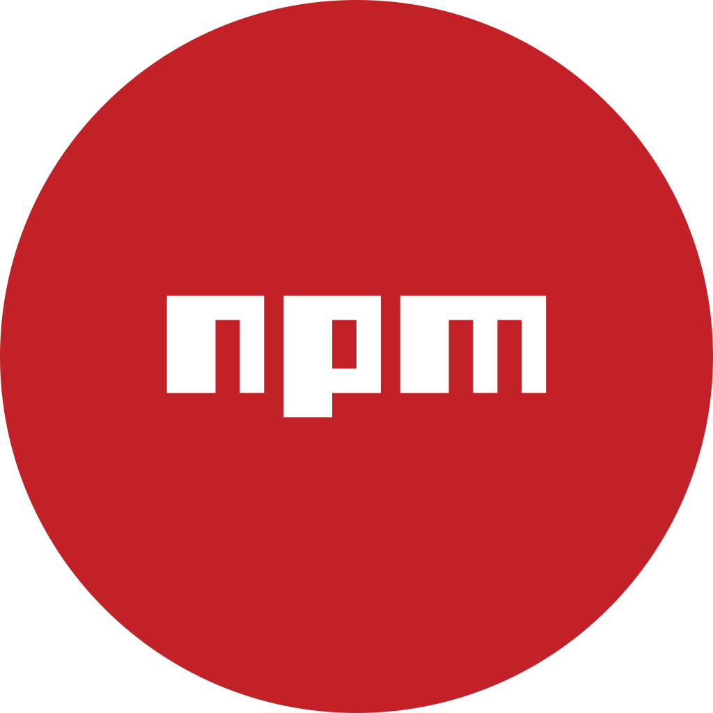
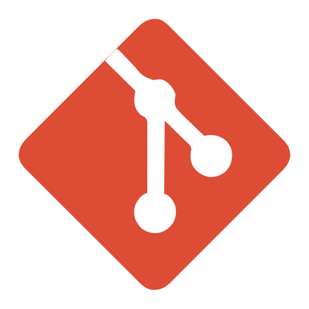

# Improve Product Statistics Bot — Español

Versión en español del [README principal](../../../README.md).

---

<div align="center">
  
</div>

<div align="right">
  
  &nbsp;
  
  &nbsp;
  
  &nbsp;
  
  &nbsp;
  
  &nbsp;
  
</div>

<br>

<div align="right">
  <a href="./README.es.md" target="_blank">
    
  </a>
  &nbsp;
  <a href="../../../README.md" target="_blank">
    
  </a>
</div>

<div align="center">

# Improve Product Statistics Bot 

</div>

Bot de automatización que **visita publicaciones de Marketplace** (Facebook activo; MercadoLibre preparado pero deshabilitado) para mover estadísticas, con **monitor en vivo**, panel de **Acciones** (pruebas Gmail / WhatsApp) y página de **Base de datos**. Lo ideal es correrlo en **Docker** local 24/7.

**UI local:** [http://localhost:9008](http://localhost:9008/)

> No es un chatbot conversacional: es un **bot de automatización** (visitas + monitor + alertas). CallMeBot solo entrega WhatsApp.

<br>

## Índice 📜

<details>
  <summary> Ver detalle </summary>

<br>

<div align="right">

`Última actualización: 13/08/26`

</div>

### Sección 1) Descripción, configuración y tecnologías

* [1.0) Descripción.](#10-descripción-)
* [1.1) Ejecución.](#11-ejecución-)
* [1.2) Estructura.](#12-estructura-)
* [1.3) Tecnologías.](#13-tecnologías-)

### Sección 2) Flujo de uso

* [2.0) Flujo de la app.](#20-flujo-de-la-app-)
* [2.1) Monitor.](#21-monitor-)
* [2.2) Acciones (Gmail y CallMeBot).](#22-acciones-gmail-y-callmebot-)
* [2.3) Base de datos.](#23-base-de-datos-)
* [2.4) Política de notificaciones.](#24-política-de-notificaciones-)

### Sección 3) Pruebas, Docker y referencias

* [3.0) Prueba funcional.](#30-prueba-funcional-)
* [3.1) Docker (recomendado en Windows).](#31-docker-recomendado-en-windows-)
* [3.2) Contribuir.](#32-contribuir-)
* [3.3) Licencia.](#33-licencia-)

</details>

---

## Sección 1) Descripción, configuración y tecnologías

### 1.0) Descripción [🔝](#índice-)

<details>
<summary>Ver detalle</summary>

Servicio Node.js + Puppeteer: abre URLs de listings en navegador headless, registra OK/fallo y muestra una UI de operaciones en el puerto **9008**.

Incluye:

* **Bots de visita:** Facebook Marketplace (`enabled: true`); MercadoLibre (`enabled: false`).
* **Monitor (`/`):** métricas, gráficos, filtros, historial, fallos (Socket.IO).
* **Acciones (`/actions.html`):** estado de canales, mostrar/ocultar teléfono y mail, tests, reporte diario, historial persistido.
* **Base de datos (`/admin.html`):** meta de `visits.json`, resumen de `actions.json`, vaciar solo visitas.
* **Notificaciones:** reporte 21:00 AR por Gmail + WhatsApp; fallos por WA si llega al instante, si no Gmail ya.

**Requisitos:** Node ≥ 18, Docker Desktop (recomendado), App Password de Gmail y/o CallMeBot.

</details>

### 1.1) Ejecución [🔝](#índice-)

<details>
  <summary>Ver detalle</summary>

<br>

* Clonar el repo:

```bash
git clone https://github.com/andresWeitzel/improve-product-statistics-bot.git
cd improve-product-statistics-bot
cp .env.example .env
cp facebook.urls.example.json facebook.urls.json
cp mercadolibre.urls.example.json mercadolibre.urls.json
```

Las URLs van en los JSON locales (`facebook.urls.json` / `mercadolibre.urls.json`, gitignored). Los `*.urls.example.json` son solo placeholders.

#### Gmail (App Password)

Para el **reporte diario** y el **fallback de fallos** cuando CallMeBot encola.

1. Activá [verificación en 2 pasos](https://myaccount.google.com/security).
2. Creá una [contraseña de aplicación](https://myaccount.google.com/apppasswords) (Mail).
3. En `.env`:

```env
MAIL_ENABLED=true
MAIL_USER=tu-correo@gmail.com
MAIL_PASS=xxxx xxxx xxxx xxxx
MAIL_TO=tu-correo@gmail.com
MAIL_FROM=Improve Product Stats <tu-correo@gmail.com>
MAIL_FAIL_ENABLED=true
REPORT_HOUR=21
REPORT_PLATFORM=facebook
```

> `MAIL_PASS` es la App Password de 16 caracteres, no la contraseña normal de Gmail.

#### WhatsApp (API CallMeBot)

Para tests, alertas de fallo y el reporte diario por WhatsApp.

1. Activá el bot según: [CallMeBot — Free WhatsApp API](https://www.callmebot.com/blog/free-api-whatsapp-messages/).
2. Completá en `.env`:

```env
WHATSAPP_ENABLED=true
WHATSAPP_PHONE=54911xxxxxxxx
WHATSAPP_APIKEY=tu-apikey
WHATSAPP_REPORT_ENABLED=true
```

> Free ≈ **16 msgs / 240 min**. Si encola → fallback a Gmail en fallos.

Pruebas rápidas:

```bash
npm run whatsapp:test
npm run report:preview
```

#### Docker (recomendado en Windows, 24/7)

```text
1) Docker Desktop → Engine running
2) scripts\Start-Bot-Docker.bat
3) Día a día → Start/Stop del contenedor
```

`docker-compose` carga `.env` y monta los JSON de URLs + `data/`.

No uses `npm run dev` y Docker juntos en el puerto **9008**.

#### Desarrollo local (opcional)

```bash
npm install
npm run dev
```

Abrí [http://localhost:9008](http://localhost:9008/).

</details>

### 1.2) Estructura [🔝](#índice-)

<details>
<summary>Ver detalle</summary>

Misma estructura que el README en inglés: `public/`, `src/platforms`, `src/notifications`, `src/db`, `scripts/`, `doc/assets/`, `Dockerfile`, `docker-compose.yml`, `*.urls.example.json` (los `*.urls.json` reales van gitignored).

Persistencia en `data/` (gitignored): `visits.json`, `actions.json`, perfiles de browser.

</details>

### 1.3) Tecnologías [🔝](#índice-)

<details>
<summary>Ver detalle</summary>

Node.js, Express, Socket.IO, Puppeteer (+ stealth), Nodemailer (Gmail), CallMeBot (WhatsApp), Docker, HTML/CSS/JS vanilla.

</details>

---

## Sección 2) Flujo de uso

### 2.0) Flujo de la app [🔝](#índice-)

<details>
<summary>Ver detalle</summary>

Arranque → carga DB → agenda reporte → bots activos visitan → UI Monitor / Acciones / Admin.

</details>

### 2.1) Monitor [🔝](#índice-)

<details>
<summary>Ver detalle</summary>

<p align="center">
  
</p>

Métricas, gráficos, filtros e historial. Vaciar visitas solo desde **Base de datos**.

</details>

### 2.2) Acciones (Gmail y CallMeBot) [🔝](#índice-)

<details>
<summary>Ver detalle</summary>

<p align="center">
  
</p>

* Destino/número ocultos con **Mostrar / Ocultar**.
* Test WA, alerta de fallo, reporte (vista previa / Gmail / WA / ambos).
* Historial en `data/actions.json` con filtros.
* Cupo CallMeBot free ≈ 16 msgs / 240 min; si encola → fallback Gmail.

<p align="center">
  
</p>

</details>

### 2.3) Base de datos [🔝](#índice-)

<details>
<summary>Ver detalle</summary>

<p align="center">
  
</p>

| Archivo | Contenido |
|---------|-----------|
| `data/visits.json` | Visitas |
| `data/actions.json` | Envíos / tests / reportes |

Vaciar visitas **no** borra el log de acciones.

</details>

### 2.4) Política de notificaciones [🔝](#índice-)

<details>
<summary>Ver detalle</summary>

| Evento | Canal |
|--------|-------|
| Reporte diario 21:00 AR | Gmail + WhatsApp |
| Fallo de visita | WA si inmediato; si no, Gmail |
| `whatsapp:test` | Solo conectividad |

Variables clave: ver `.env.example` (`MAIL_*`, `WHATSAPP_*`, `REPORT_HOUR`).

</details>

---

## Sección 3) Pruebas, Docker y referencias

### 3.0) Prueba funcional [🔝](#índice-)

<details>
<summary>Ver detalle</summary>

1. UI en `:9008` conectada.
2. `npm run whatsapp:test`
3. `npm run whatsapp:fail:preview` / `whatsapp:fail`
4. `npm run report:preview` / `report:send:gmail`

</details>

### 3.1) Docker (recomendado en Windows) [🔝](#índice-)

<details>
<summary>Ver detalle</summary>

```text
1) Docker Desktop → Engine running
2) scripts\Start-Bot-Docker.bat
3) Start/Stop desde Docker Desktop
```

| Flag | Efecto |
|------|--------|
| (ninguno) | Build + `up -d` |
| `-SkipStart` | Solo build |
| `-Clean` | `compose down` antes |

Puerto `9008`, volumen `./data`, Chromium en `/usr/bin/chromium`.

</details>

### 3.2) Contribuir [🔝](#índice-)

<details>
<summary>Ver detalle</summary>

Fork → branch → commit → PR. No subir `.env` ni secretos.

</details>

### 3.3) Licencia [🔝](#índice-)

<details>
<summary>Ver detalle</summary>

ISC — [Andrés Weitzel](https://github.com/andresWeitzel).

</details>
